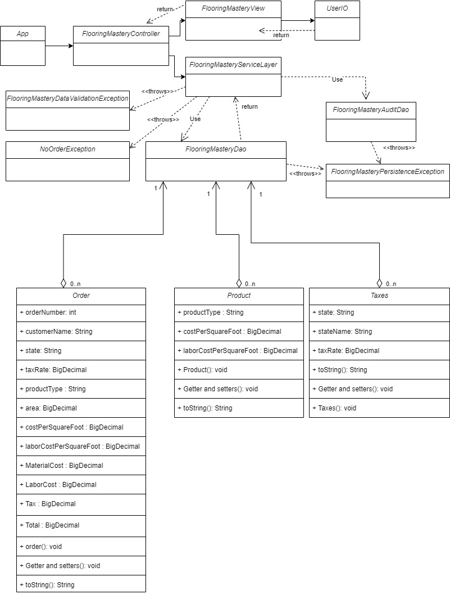

# Flooring Mastery Company Order Application
An application that can read and write flooring orders. 

This applications tests my knowdlege and understanding of the following topics:
* N-tier/MVC architecture
* Interfaces
* Spring dependency Injection
* Unit Testing

# Rules of the application
* Using an enterprise MVC architecture 
    * Code must be organized into reasonable classes. 
* Draw a UML class diagram and high-level flowchart
* Layers of the code:
    * Model package:
        * Contain classes that have data members (properties).
    * dao package:
        * Contains classes that are responsible for persisting data.
    * Controller package 
        * Contains classes that orchestrate the program.
    * View package 
        * Contains classes that interact with the user.
    * Service package 
        * Contains the service layer components.
    * UserIO class 
        * View component that will handle all console IO for the user.

# Files Format

* Backup File

| OrderNumber   | CustomerName  | State | TaxRate   | ProductType   | Area  | CostPerSquareFoot | LaborCostPerSquareFoot    | MaterialCost  | LaborCost | Tax   | Total | OrderDate |
| ------------- | ------------- | ----- | --------- | ------------- | ----- | ----------------- | ------------------------- | ------------- | --------- | ----- | ----- | --------- |

* Product File

| ProductType   | CostPerSquareFoot  | LaborCostPerSquareFoot | 
| ------------- | ------------------ | ---------------------- | 

* Taxes File

| State   | StateName  | TaxRate | 
| ------- | ---------- | ------- | 

* Order File

| OrderNumber   | CustomerName  | State | TaxRate   | ProductType   | Area  | CostPerSquareFoot | LaborCostPerSquareFoot    | MaterialCost  | LaborCost | Tax   | Total |  
| ------------- | ------------- | ----- | --------- | ------------- | ----- | ----------------- | ------------------------- | ------------- | --------- | ----- | ----- | 

# Rough Class Diagram

